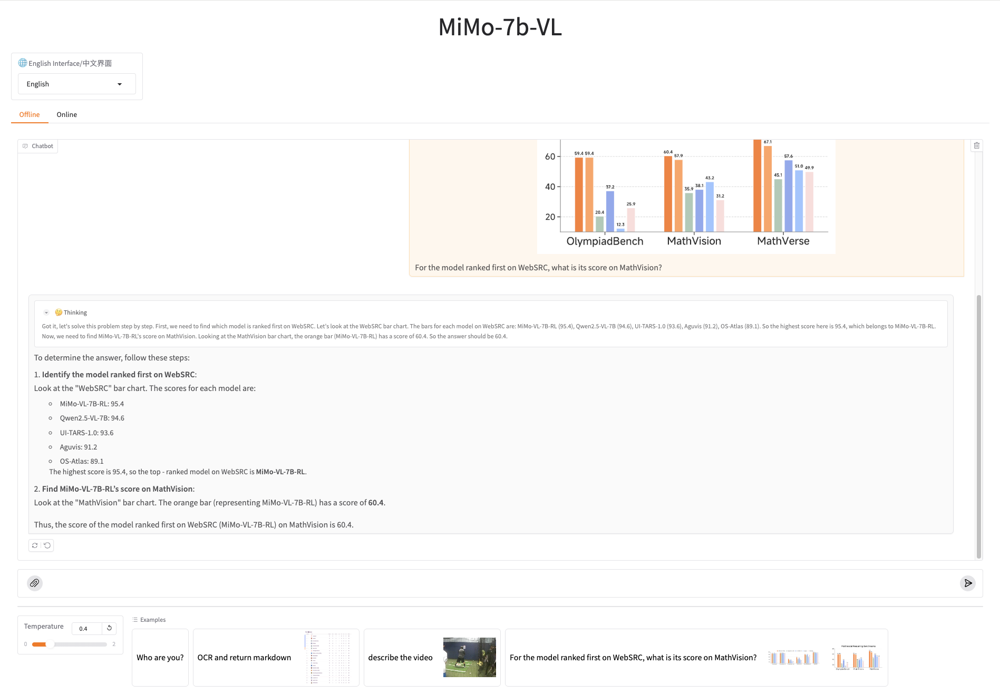

### MiMo-VL Gradio Demo

#### Installation

```
pip install gradio decord torchvision
pip install httpx==0.23.3
```

#### Launch

```
CKPT_PATH="/your/custom/checkpoint/path" python app.py
```




Enjoy MiMo-VL! 🤗
